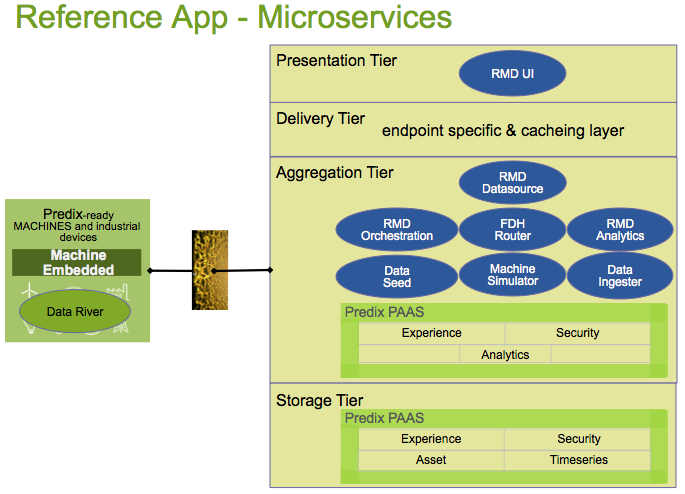
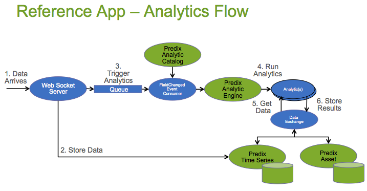
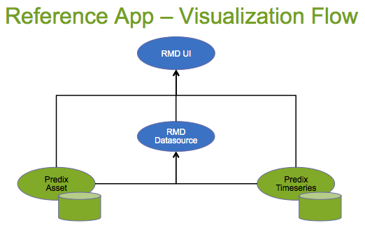

Predix RMD Reference App
=====================

Welcome to the Predix Remote Monitoring & Diagnostics (RMD) Reference Application.  You can view the [Reference App](https://rmd-ref-app.run.aws-usw02-pr.ice.predix.io/dashboard) in your browser using these login credentials

        User: rmd_user_1
        Password: RMD_user_1

--
The Reference App Front-End and Back-End Microservices show and explain how to use the Predix PAAS to build an Industrial Internet application.  The app covers the following Predix components:

- [Predix Dashboard UI Seed](https://github.com/predixdev/predix-seed)
- [Predix Security](https://www.predix.io/docs#Jig2gorb)
- [Predix Asset](https://www.predix.io/docs#zChUPu1U)
- [Predix Timeseries](https://www.predix.io/docs#mnlfuvZz)
- [Predix Analytics](https://www.predix.io/docs#EG3xVdLg)
- [Predix Machine](https://www.predix.io/docs#mL2j0aax)
- [Predix Machine Modbus Adapter](https://www.predix.io/docs/?r=402244#wjGUrd7M)
- [Predix Data River Receiver](https://www.predix.io/docs/?r=829105#s8wRgtg6)

Architecturally the reference app is organized into four Tiers (Presentation, Delivery, Aggregation and Storage) and supports three Data Flows (Ingestion, Analytics, Visualization)
- Presentation Tier - UI layer and microservices
- Delivery Tier - Cacheing, Mobile, Personalization
- Aggregation Tier - Service Composition and Business Logic
- Storage Tier - the Predix PAAS Services

The 8 microservices are pushed to and run in cloud foundry, as follows:

###Ingestion Flow
Data Flows in two ways. Either from the MachineDataSimulator to the Timeseries Ingester which looks up the Asset Meter meta-data providing info needed to post data to the Predix Timeseries service. Or from the Predix Machine DataRiver which posts data over a websocket to the Timeseries service directly.  The Timeseries Ingester is also notified via a websocket which allows for a Live websocket feed to the RMD UI and also provides a trigger point for Analytics.

(future) Raw data often needs cleaning and preparation before it is consumable via Analytics and UI.  A best-practice would be to mark this data as raw and trigger Cleansing and Quality jobs leveraging the analytics framework.  

###Analytics Flow
Data arrives via the Ingestion Flow and is stored.  A message is placed in a queue which kicks off an Analytic Orchestration.  The Analytics uses data from Predix Asset and Predix Timeseries, produces a result, which is then stored back to Predix Asset or Predix Timeseries or potentially to/from any other datastore.

###Visualization Flow
The UI accesses data from Predix Asset directly which drives the Asset selector menu. Once a selection is made the View requests data from the RMD Datasource and returns the data from Predix Asset and Predix Timeseries in a mashup.  However, in the Graph Widget the Timeseries service is accessed directly. 

##To Download and Push
The best experience is to use a [DevBox](https://www.predix.io/catalog/other-resources/devbox.html) which has all the tools and settings pre-installed.  We have a second DevBox for GE employees which helps with corporate proxy settings.  In your own IT environment you may need to configure the proxy settings Environment variables within the VM.
For users wanting to install all the tools, please reference the DevBox settings, and also ensure you have the prerequisites installed from Predix.io [Getting Started](https://www.predix.io/docs/?b=#Uva9INX3) documentation.  

* Clone the github repository to your machine
  * git clone https://github.com/PredixDev/predix-rmd-ref-app.git
* to avoid entering user/pass several times, run this command to cache it for 70 minutes
  * git config --global credential.helper cache
* edit the /predix/.m2/settings.xml and where you see predixuser@ge.com put in your Predix.io user and pass
  * encryption instructions here: https://maven.apache.org/guides/mini/guide-encryption.html 
* Run the installRefApp.py script which handles creating services and a secure ClientId and User for the space you are currently logged in to.
  * cf login
  * python installRefApp.py
    * places projects in the PredixApps folder. 
  * Run the data-seed https://data-seed-(yourlogin).run.aws-usw02-pr.ice.predix.io 
    * Browse for the dataseed-service/src/test/resources/rmdapp/AssetData_with_model.xls and submit
    * Launch the MachineSimulator cf start machinedata_simulator_(yourlogin)
    * Launch the RefApp https://rmd-ref-app-ui-(yourlogin).run.aws-usw02-pr.ice.predix.io/dashboard 

[Pulling Submodules and Manual Steps](docs/submodules.md) - A lot goes in to Cloning, Building, Security and Pushing the RefApp. Visit this page to see a more detailed look at each command.

##Microservices
The Ref App consists of 8 microservices.  Each microservice can be individually managed and scaled, leveraging the Cloud Foundry infrastructure.   

###[RMD-Ref-App-UI](https://github.com/PredixDev/rmd-ref-app-ui#rmd-reference-application-ui-microservice)
An AngularJS/Web Components based UI framework.  We used the [Predix Dashboard Seed](https://github.com/PredixDev/predix-seed) as a starting point.  The UI talks to the RMD Datasource Service, Predix UAA, Predix Asset and Predix Timerseries back-end services.

###[RMD Datasource Service](https://github.com/PredixDev/rmd-datasource)
A Mashup Service doing much of the logic for the Reference App.  It talks to Predix Asset and Timeseries databases and return results for display.

###[Data Seed Service](https://github.com/PredixDev/data-seed-service)
A service to help create sample data in Predix Asset.  Upload a spreadsheet of data and it creates Groups, Classfications, Assets and Meters in Predix Asset. 

###[Machine Data Simulator Service](https://github.com/predixdev/machinedata-simulator/tree/master#machinedata-simulator)
  A Service to generate data when a physical machine is not available.  The Simulator sends data to the Data Ingestion Service when it is up and running.

###[Data Ingestion Service](https://github.com/PredixDev/dataingestion-service#predix-data-ingestion-service)
  A Service to accept Machine data or Simulated data, look up the Asset and Meter information in Predix Asset which provides enough info to post the data to the Timeseries database.  It also acts as a websocket server streaming live Machine sensor data to the UI.

###[RMD Orchestration Service](https://github.com/predixdev/rmd-orchestration/tree/master)
  (future)A Service that listens for FieldChangedEvent Queue messages to trigger Predix Analytic Orchestrations.  The DataIngestion service puts these messages on the queue when data for a Field representing a Sensor arrives.  Orchestrations themselves can also place messages on the queue which can trigger more Orchestrations updating attributes up (or down) the Asset Hierarchy.

###[RMD Analytic Service](https://github.com/predixdev/rmd-analytics/tree/master#analytics-for-predix-rmd-reference-app)
  An Analytic Microservice framework that receives Orchestration requests, resolves data and computes results.  The analytics can be in the cloud, streaming analytics, against near-data datasources (hadoop, etc), or also at the edge (on Machines outside the cloud).

###[FDH Datahandler Service](https://github.com/predixdev/fdh-router-service/tree/master#fdh-router-service)
  The Federated Data Handler framework retrieves data from any Datasource using a simple Get or Put API.  The Analytic framework leverages it to retrieve data and store results. FDH can help manage data Get/Put requests that are from distributed, near-data, relational db, public internet, in a file, via other Rest APIs and also at the Edge (on Machines outside the cloud).

##Asset Model
Since Predix Asset comes with an empty database, the Reference App creates a data 'model' depicted below, which sets up entities and attributes for Groups, Classifications, Assets and Meters.

Note: Meter will change to Parameter in a future release

The model has these characteristics:
- A Turbine, for example,  is Modeled as a Classification
- (future)A Device, such as a Honeywell Controller, is modeled as a Classification
- (future)A DeviceMeter is hooked to Predix Machine and a data Node retrieves data using an Adapter.  
- An AssetMeter is hooked to Predix Machine and a data Node retrieves data using an Adapter.  
- A Predix Machine can talk to many Devices on many Industrial Machines
- A Meter represents a Timeseries Data parameter, either raw sensor data or calculated data
- (future)A DeviceAsset is an instance of a Device classification and has DeviceMeter instance attributes
- An AssetGroup can be a location (Site,Plant,etc) or an entity(Enterprise,City,County) that logically holds a set of Assets
- An Asset is an instance of a Classification and has singleValue Attributes as well as AssetMeter instance attributes
- AssetMeter knows of it's Unit of Measure and also has a key to several Datasources
DeviceMeter ID
Node ID
Timeseries Tag ID
- A Field further describes any Attribute for purposes such as DataIngestion, UI, DataBinding for FederatedQuery, Analytics
- A Field has a FieldSource that describes how or where the data is stored for an Attribute
- A Field has a DataHandler uri that knows how to retrieve or store data from/to a FieldSource
- (future)A MachineAsset can be modeled to navigate from the Machine Id to the Devices and Assets

##APIs
The reference app defines some apis and message bodies that are needed to communicate between microservices.
* [RMD Datasource](https://github.com/PredixDev/rmd-datasource)
* [Data Ingestion](https://github.com/PredixDev/dataingestion-service)
* [Run Analytic](https://github.com/PredixDev/ext-interface)
* [Federated Datahandler](https://github.com/PredixDev/ext-interface)
* [FieldChangedEvent](https://github.com/PredixDev/ext-interface/tree/master/ext-model)

##Microcomponents
* [Predix Microcomponent Bootstraps](docs/microcomponents.md) - reusable libraries that can be used in any microservice

### More Details
* [RMD overview](docs/overview.md) - the Remote Monitoring & Diagnostics use-case
* [Front end development notes](https://github.com/predixdev/rmd-ref-app-ui/tree/master/public/docs/frontEndDev.md) - details on front end configuration, controllers, widgets, etc.
* [How to customize a widget](https://github.ge.com/predixdev/rmd-ref-app-ui/tree/master/public/docs/customizeWidget.md) - steps to create a custom Predix dashboard widget.
* [Securing an application](docs/security.md)
* [More GE resources](docs/resources.md)
